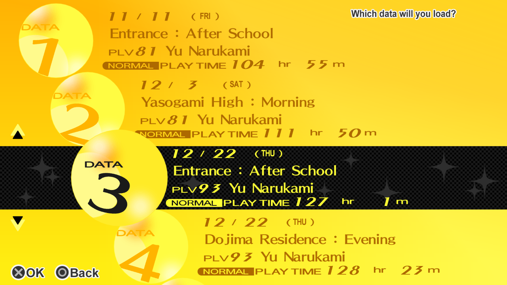
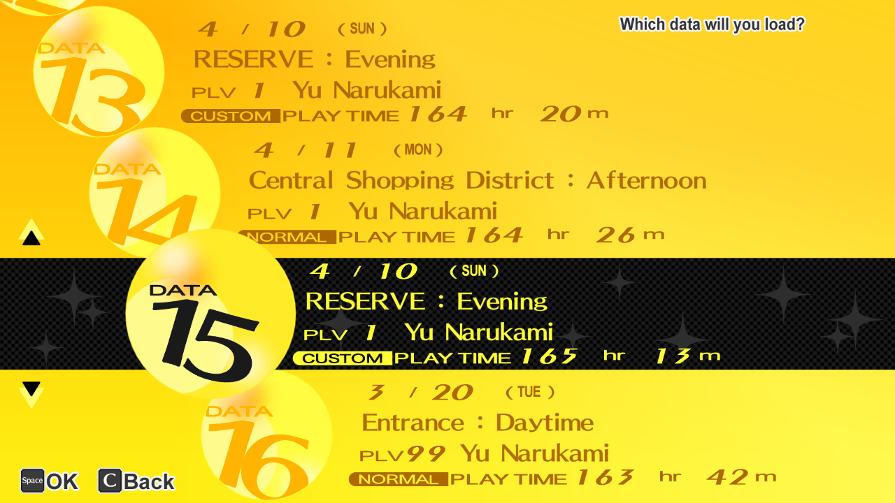
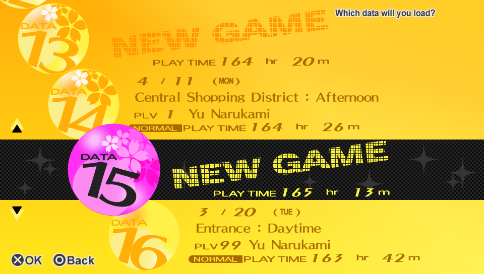

# Persona 4 Golden Save Converter

This repo contains:

- `convert_vita2pc.py`, a utility that converts P4G PS Vita saves to P4G PC saves:

  - PS Vita `data00XX.bin` and `system.bin` files are converted to the PC format (see [FAQ #1](#faq)).
  - PS Vita `sdslot.dat` file is converted to PC `data00XX.binslot` files (see [FAQ #2](#faq)).
  - A `remotecache.vdf` file is generated with valid entries for each save file (see [FAQ #3](#faq)).

  **This tool will convert the above into proper PC `.bin`/`.binslot` files.**

  **There's no need to edit any hashes manually.**

- `convert_pc2vita.py`, a utility that converts P4G PC saves to P4G PS Vita saves.

**WARNING: REMEMBER TO BACKUP YOUR SAVES BEFORE CONVERSION.**

| PS Vita                       | PC                        |
| :---------------------------: | :-----------------------: |
|  |  |

## Requirements

- PS Vita with HENkaku + VitaShell or vita-savemgr
- Persona 4 Golden on PS Vita - supported versions:
  - `PCSE00120` (USA)
  - `PCSB00245` (EUR)
- Persona 4 Golden on PC
- Python 3

## Usage

### PS Vita Saves to PC Saves

#### Dumping Saves from PS Vita

Use VitaShell or vita-savemgr to export a save.
Transfer the exported save directory to PC using FTP/USB.

For example, using VitaShell:

- Navigate to `ux0:user/00/savedata/`.
- "Select" the `PCSE00120` directory.
- Press *Triangle* and select *Open decrypted*.
- Using FTP/USB, copy the saves to a directory on PC.

The directory you exported to PC should look like the following, if all save slots were populated:

```txt
PCSE00120/
|- sce_sys/
|  \- sdslot.dat
|- data0001.bin
|- data0002.bin
|- ...
|- data0016.bin
\- system.bin
```

Note that the `sce_sys` directory contains other files, but they are not relevant to the conversion process.

#### Converting Saves to PC Format

1. Clone or download this repository.
2. Convert your PS Vita saves using:

   ```sh
   python convert_vita2pc.py [--custom-diff {disable,enable}] save_dir
   ```

   This utility will generate:

   - a `<save_dir>_conv` directory containing the converted saves
   - a `remotecache.vdf` file

3. Exit Steam - make sure Steam is not running in the background.

4. Backup the contents of the `%PROGRAMFILES(X86)%/Steam/userdata/<user_id>/1113000/` dir.

5. Copy the converted saves in `<save_dir>_conv` to `%PROGRAMFILES(X86)%/Steam/userdata/<user_id>/1113000/remote/`, overwriting files as necessary.

   Copy the generated `remotecache.vdf` to `%PROGRAMFILES(X86)%/Steam/userdata/<user_id>/1113000/`, overwriting the original file if necessary.

6. Start Steam and launch the game.
   In case of a Steam Cloud sync conflict, choose to upload local files to the cloud.

7. Your imported saves should now appear in the LOAD GAME menu.

### PC Saves to PS Vita

#### Converting Saves to PS Vita Format

1. Clone or download this repository.

2. Copy the saves in `%PROGRAMFILES(X86)%/Steam/userdata/<user_id>/1113000/remote/` to another location as a precaution.

3. Run the following on the directory you've copied:

   ```sh
   python convert_pc2vita.py [--custom-diff {disable,enable}] save_dir
   ```

   This utility will generate a `<save_dir>_conv` directory containing the converted saves.

4. Move the converted saves to PS Vita (see [here](#moving-converted-saves-to-ps-vita)) and launch the game.

5. Your imported saves should now appear in the LOAD GAME menu.

#### Moving Converted Saves to PS Vita

Copy the converted saves in `<save_dir>_conv` to `ux0:user/00/savedata/PCSE00120/` using VitaShell FTP/USB.
Overwrite files as needed (*remember to backup the saves already on PS Vita too*).
You should only need to overwrite `data00XX.bin`, `system.bin` and the `sce_sys/sdslot.dat` file.

**Do not replace the entire save directory on PS Vita**.
Only overwrite the `.bin` files within the save directory (as needed) + `sce_sys/sdslot.dat`.

## FAQ

1. Why do I need to convert the saves? PS Vita saves seem to work fine without conversion.

    - The PC save format is slightly different (see [Save Format Changes](#save-format-changes)).
      If you load a PS Vita save directly without conversion, you might get the following error:

        

        This can be avoided by converting the saves properly.

2. Why do I need to include `sdslot.dat`?

    - PS Vita saves store metadata in the `sdslot.dat` file, which can be found in `ux0:user/00/savedata/PCSE00120/sce_sys/`.
      PC saves store metadata in `binslot` files.
      This converter takes data found in `sdslot.dat` and converts it to the PC `binslot` format (see [Save Format Changes](#save-format-changes)).

3. Why can't I see some of my saves in the save select screen?
   Why am I getting a "Load failed." message when trying to load a save?
   Why do I need a `remotecache.vdf` file?

    - The game uses the Steam Storage API to enumerate game saves.
      Each save file needs to have a valid entry in `%PROGRAMFILES(X86)%/Steam/userdata/<user_id>/1113000/remotecache.vdf`.
      This program will generate a valid `remotecache.vdf` file when converting saves.

      You can also use `remotecache.py` to regenerate a valid `remotecache.vdf`.

4. Why does my Clear Data save look like this? Why aren't NG+ saves colored pink/purple in the save select screen?

    

    - This is by a bug in the game itself.
      Note that the saves work as they should, the only issue is with how the save metadata is displayed.
      Wait for a patch, or use [this mod](https://github.com/zarroboogs/p4gpc.tinyfixes) to fix the issue.

        Also note that when converting a Clear Data (save 13 below) or NG+ save (save 14 below) *generated on PC* to PS Vita format, the save metadata is read correctly by the PS Vita version of the game:

        | PC                      | PS Vita                     |
        | :---------------------: | :-------------------------: |
        |  |  |

## Save Format Changes

### Config Settings

Config settings are no longer saved in `system.bin`, instead there's a config `P4G.ini` file in `%LOCALAPPDATA%/Sega/P4G/`.

### `.bin` Files

- The *Rescue Requests* save segment increased in size (due to internal struct changes), from `0x2908` bytes (PS Vita) to `0x3FAC` bytes (PC).
- PC saves contain a new save segment (`0x30` bytes) that contains the Hero's name.
- PS Vita saves are padded to `0x38000` bytes with garbage data from PS Vita memory. PC saves aren't padded (`0x34D3D` bytes).

### `.binslot` Files

BINslot files are the PC alternative to `sdslot.dat`.

BINslot file structure:

```cpp
typedef struct
{
    char Magic[ 0x08 ]; // SAVE0001

    ubyte SlotFile_MD5[ 0x10 ]; // md5sum of bytes 0x28 to EOF (SlotData)
                                // *** with P4GOLDEN appended to the end ***

    ubyte SaveFile_MD5[ 0x10 ]; // md5sum of corresponding data00XX.bin or system.bin file

    ubyte SlotData[ 0x34C ]; // slot data, same as sdslot.dat data
                             // at offset 0x400 + <save_num> * 0x400
                             // save 0 == system.bin
                             // save 1 == data0001.bin
                             // etc.

} BINslot;

BINslot Slot;
```

<!--
Why append `P4GOLDEN` to the end of `SlotData` for md5sum calculation?

Because ATLUS.

That's why.

`(ノಠ益ಠ)ノ彡┻━┻`
-->
